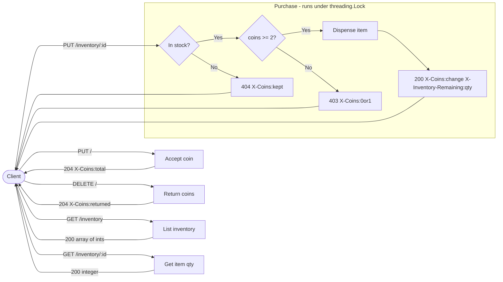

# Vend-O-Matic

A beverage vending machine simulator exposed as an HTTP API. Built with Python stdlib only — no external dependencies.

## How It Works

The diagram below shows every route the server exposes and how a request flows through the system. Simple reads (`GET`) and coin operations (`PUT /`, `DELETE /`) resolve immediately against shared state. A purchase (`PUT /inventory/:id`) runs through a two-step decision tree — out-of-stock is checked before insufficient funds — with all state mutations protected by a `threading.Lock` to keep concurrent requests safe.



## Requirements

- macOS (tested on macOS Sequoia) — Python 3.12 ships with Xcode Command Line Tools
- Python 3.7+ (`python3 --version` to confirm)
- No packages to install

## Setup & Running

```bash
# Verify Python is available
python3 --version

# Start the server (default port 8080)
python3 app.py

# Or use a custom port
PORT=9000 python3 app.py
```

The server will print:

```
Vend-O-Matic listening on port 8080
```

Stop it with `Ctrl+C`.

## Running Tests

```bash
python3 -m unittest test_app -v
```

The `-v` flag prints each test by name as it runs. You'll see output like this:

```
test_cancel_resets_coin_count ... ok
test_cancel_returns_coins ... ok
test_cancel_with_no_coins ... ok
test_get_inventory_after_purchase ... ok
test_get_inventory_initial ... ok
test_get_item_invalid_id ... ok
test_get_item_quantity ... ok
test_happy_path_purchase ... ok
test_insert_one_coin ... ok
test_insert_two_coins ... ok
test_insert_zero_coin_noop ... ok
test_insufficient_funds_one_coin ... ok
test_insufficient_funds_zero_coins ... ok
test_inventory_decrements_correctly ... ok
test_out_of_stock_checked_before_insufficient_funds ... ok
test_out_of_stock_returns_404 ... ok
test_purchase_invalid_item_id ... ok
test_purchase_with_change ... ok
test_unknown_get_route ... ok
test_unknown_put_route ... ok

----------------------------------------------------------------------
Ran 20 tests in 0.5s

OK
```

Each line is one test case. `ok` means it passed. The suite spins up a real HTTP server on port 18080 for the duration of the run — no mocking — so every test exercises the full request/response cycle. A summary at the bottom shows the total count and overall result. All 20 must pass before submitting.

---

## Vending Machine Rules

- Only accepts US quarters, one at a time (`{"coin": 1}`)
- Each item costs **2 quarters**
- 3 beverages available (IDs `0`, `1`, `2`), 5 of each to start
- Accepts more than the purchase price but dispenses only one item per transaction
- Any unused quarters are returned as change via `X-Coins`
- All requests and responses use `Content-Type: application/json`

---

## API Reference

| Method | Path | Request Body | Response Code | Response Headers | Response Body |
|--------|------|-------------|--------------|-----------------|---------------|
| `PUT` | `/` | `{"coin": 1}` | 204 | `X-Coins`: total accepted so far | — |
| `DELETE` | `/` | — | 204 | `X-Coins`: quarters returned | — |
| `GET` | `/inventory` | — | 200 | — | `[5, 5, 5]` (array of ints) |
| `GET` | `/inventory/:id` | — | 200 | — | integer |
| `PUT` | `/inventory/:id` | — | 200 | `X-Coins`: change returned, `X-Inventory-Remaining`: qty left | `{"quantity": 1}` |
| `PUT` | `/inventory/:id` *(out of stock)* | — | 404 | `X-Coins`: coins kept | — |
| `PUT` | `/inventory/:id` *(insufficient funds)* | — | 403 | `X-Coins`: `0` or `1` | — |

**Notes:**
- Out-of-stock (404) takes priority over insufficient funds (403)
- On a successful purchase, change is automatically returned via `X-Coins`

---

## curl Examples

### Happy path — insert 2 coins, buy item 0

**Command** — insert first coin:
```bash
curl -X PUT http://localhost:8080/ \
  -H "Content-Type: application/json" \
  -d '{"coin": 1}' -i
```
**Expected response:**
```
HTTP/1.0 204 No Content
X-Coins: 1
```

**Command** — insert second coin:
```bash
curl -X PUT http://localhost:8080/ \
  -H "Content-Type: application/json" \
  -d '{"coin": 1}' -i
```
**Expected response:**
```
HTTP/1.0 204 No Content
X-Coins: 2
```

**Command** — purchase item 0:
```bash
curl -X PUT http://localhost:8080/inventory/0 -i
```
**Expected response:**
```
HTTP/1.0 200 OK
X-Coins: 0
X-Inventory-Remaining: 4

{"quantity": 1}
```

---

### Insert extra coins — change is returned

**Command** — reset state from previous example:
```bash
curl -X DELETE http://localhost:8080/ -i
```
**Expected response:**
```
HTTP/1.0 204 No Content
X-Coins: 0
```

**Command** — insert 3 coins, buy item 1 (costs 2), get 1 quarter back as change:
```bash
curl -X PUT http://localhost:8080/ -H "Content-Type: application/json" -d '{"coin": 1}' -i
curl -X PUT http://localhost:8080/ -H "Content-Type: application/json" -d '{"coin": 1}' -i
curl -X PUT http://localhost:8080/ -H "Content-Type: application/json" -d '{"coin": 1}' -i
curl -X PUT http://localhost:8080/inventory/1 -i
```
**Expected response** (last command):
```
HTTP/1.0 200 OK
X-Coins: 1
X-Inventory-Remaining: 4

{"quantity": 1}
```

---

### Insufficient funds (403)

**Command** — reset state from previous example:
```bash
curl -X DELETE http://localhost:8080/ -i
```
**Expected response:**
```
HTTP/1.0 204 No Content
X-Coins: 0
```

**Command** — insert only 1 coin:
```bash
curl -X PUT http://localhost:8080/ \
  -H "Content-Type: application/json" \
  -d '{"coin": 1}' -i
```
**Expected response:**
```
HTTP/1.0 204 No Content
X-Coins: 1
```

**Command** — try to buy with insufficient funds:
```bash
curl -X PUT http://localhost:8080/inventory/1 -i
```
**Expected response:**
```
HTTP/1.0 403 Forbidden
X-Coins: 1
```

---

### Cancel — return all inserted coins

**Command** — reset state from previous example:
```bash
curl -X DELETE http://localhost:8080/ -i
```
**Expected response:**
```
HTTP/1.0 204 No Content
X-Coins: 0
```

**Command** — insert a coin, then change your mind:
```bash
curl -X PUT http://localhost:8080/ \
  -H "Content-Type: application/json" \
  -d '{"coin": 1}' -i
```
**Expected response:**
```
HTTP/1.0 204 No Content
X-Coins: 1
```

**Command** — cancel and return coins:
```bash
curl -X DELETE http://localhost:8080/ -i
```
**Expected response:**
```
HTTP/1.0 204 No Content
X-Coins: 1
```

---

### Out of stock (404)

**Command** — deplete item 2 (5 purchases):
```bash
for i in 1 2 3 4 5; do
  curl -s -X PUT http://localhost:8080/ -H "Content-Type: application/json" -d '{"coin": 1}' > /dev/null
  curl -s -X PUT http://localhost:8080/ -H "Content-Type: application/json" -d '{"coin": 1}' > /dev/null
  curl -s -X PUT http://localhost:8080/inventory/2 > /dev/null
done
```

**Command** — insert 2 coins and try to buy item 2 — now out of stock:
```bash
curl -X PUT http://localhost:8080/ -H "Content-Type: application/json" -d '{"coin": 1}' -i
curl -X PUT http://localhost:8080/ -H "Content-Type: application/json" -d '{"coin": 1}' -i
curl -X PUT http://localhost:8080/inventory/2 -i
```
**Expected response** (last command):
```
HTTP/1.0 404 Not Found
X-Coins: 2
```

---

### Check inventory

> Note: the values below reflect running all examples above in order (item 2 fully depleted). On a fresh server start you will see `[5, 5, 5]` and `5`.

**Command** — get all item quantities:
```bash
curl http://localhost:8080/inventory
```
**Expected response:**
```
[5, 5, 0]
```

**Command** — get quantity for a single item:
```bash
curl http://localhost:8080/inventory/2
```
**Expected response:**
```
0
```

---

## Design Decisions

**No external dependencies.**
The spec asked to avoid reimplementing HTTP or string-concatenating JSON, but also to minimize dependencies. Python's `http.server` and `json` modules hit that balance exactly — HTTP is handled by `BaseHTTPRequestHandler`, and JSON is serialized with `json.dumps()` / parsed with `json.loads()`.

**`ThreadingHTTPServer` + `threading.Lock` for concurrency.**
`ThreadingHTTPServer` spawns a new thread per request, which means multiple clients can hit the server simultaneously. A single module-level `_lock` guards all reads and writes to `_state`, ensuring coin counts and inventory quantities are always consistent. The entire purchase decision (check stock → check funds → decrement) happens inside one `with _lock:` block so there's no window for a race condition between two concurrent buyers.

**Error priority: 404 before 403.**
When a purchase is attempted, out-of-stock is checked before insufficient funds. This matches the spec's footnote ordering and makes physical sense — the machine should tell you it's empty before asking for more money.

**`_send_error_plain` instead of `send_error()`.**
The stdlib's `BaseHTTPRequestHandler.send_error()` appends an HTML body to every error response. The spec defines clean, header-only error responses, so we bypass it entirely and write the status + headers directly.

**`allow_reuse_address` as a class attribute.**
`SO_REUSEADDR` must be set on the socket before `bind()` is called. Because `ThreadingHTTPServer.__init__` calls `bind()` immediately, the flag has to live as a class attribute on a subclass rather than being set on the instance after construction. This lets the server restart immediately without an "Address already in use" error.

**`{"quantity": 1}` in the purchase response body.**
The spec defines `quantity` as "number of items vended" in the transaction — always 1, since the machine dispenses a single beverage per transaction. The remaining stock after purchase is communicated separately via `X-Inventory-Remaining`.
